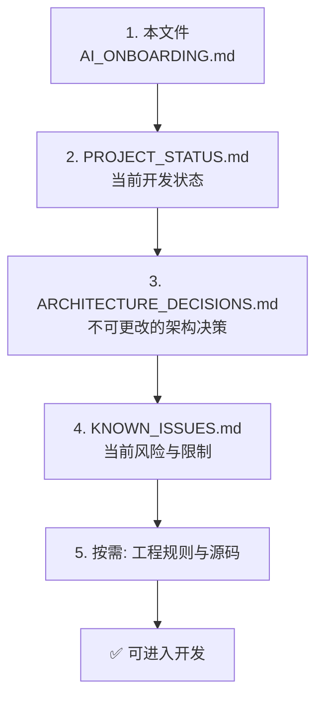
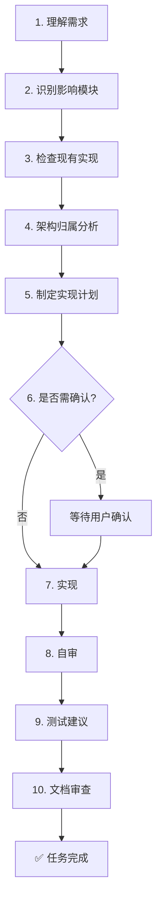
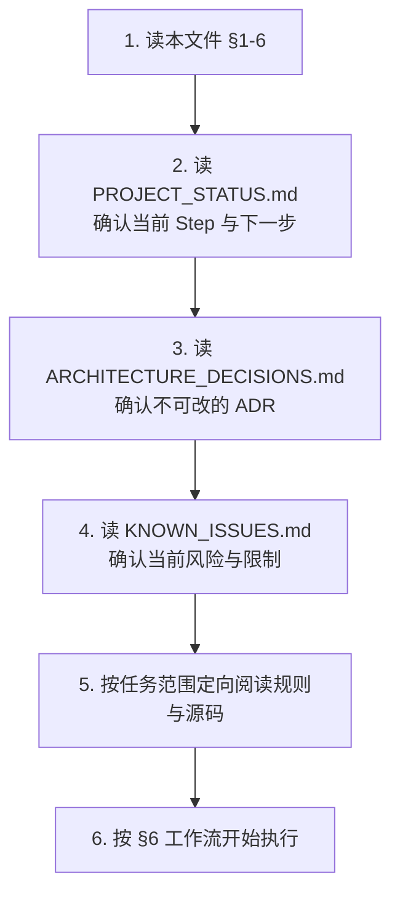

# AI_ONBOARDING.md — PhotoArchiver AI Runtime Context 入口

> **本文档是 AI Runtime Context 的唯一入口（Single Entry Point）。**
>
> 任何 AI 在新 Session 开始时**必须**首先阅读本文件。
>
> 本文件回答的唯一问题：**"为了开始开发，我应该先了解什么？"**
>
> Version: 1.0.0 ｜ Status: Stable ｜ 适用范围: 任何 AI 编码助手（Codex / Claude / Gemini / Cursor / Windsurf / Roo Code / Cline / AtomCode 及未来 AI）

---

## ⚠️ 本文档不是什么

| 不是 | 这些应在别处找 |
|---|---|
| README 或项目介绍 | `README.md`、`docs/` |
| 架构设计或 ADR | `ARCHITECTURE_DECISIONS.md` |
| 当前开发进度或下一步任务 | `PROJECT_STATUS.md` |
| 当前 Bug / 技术债 / 风险 | `KNOWN_ISSUES.md` |
| 历史聊天记录或会话交接 | 不保留（状态永远只活在 `PROJECT_STATUS.md` 当前快照） |

---

## 1. 项目定位（Project Identity）

| 项 | 值 |
|---|---|
| 项目名 | PhotoArchiver |
| 一句话 | 基于 DDD + Clean Architecture 的企业级桌面照片归档管理系统，面向学校/政府/企业/档案馆/摄影工作室等管理大量历史照片 |
| 技术栈 | Python 3.11、PySide6、SQLite、InsightFace、ONNX Runtime、Pillow、pandas、openpyxl、Loguru、pytest、Ruff、MyPy |
| 平台 | Windows、macOS |
| 仓库 | `github.com/Rookievegetable/PhotoArchiver` |
| 入口 | `main.py`（CLI 扫描 + PySide6 桌面） |

完整技术栈与权威清单：`.ai/rules/dependency-rules.md` §13、`.ai/rules/ai-rules.md` §3。

---

## 2. Context 加载顺序（Reading Order）

> 顺序不可跳过。每步为下一步建立必要上下文。



| 步 | 文件 | 必须理解 |
|---|---|---|
| 1 | `AI_ONBOARDING.md`（本文件） | 入口、加载顺序、AI 行为规范 |
| 2 | `PROJECT_STATUS.md` | 当前 Step、当前目标、最近一次交接、下一步 |
| 3 | `ARCHITECTURE_DECISIONS.md` | 已裁决的 ADR，AI 不得重新设计 |
| 4 | `KNOWN_ISSUES.md` | 当前未决 Bug、技术债、平台限制、临时 workaround |
| 5 | 按需阅读（见 §3） | 工程规则、源码、模块文档 |

> **关键**：第 2-4 步是恢复开发能力的最小集合。若任务范围明确，可在第 5 步定向阅读相关模块源码与规则，**不要全树预读**以节约 Token。

---

## 3. 必须阅读的文档（按需引用，不复制正文）

| 类别 | 权威位置 | 何时读 |
|---|---|---|
| AI 行为总纲 | `.ai/rules/ai-rules.md` | 任何编码前 |
| 架构规则 | `.ai/rules/architecture-rules.md` | 改动跨层、新建模块 |
| 依赖矩阵 | `.ai/rules/dependency-rules.md` | 新增 import、新增依赖 |
| 编码规则 | `.ai/rules/coding-rules.md` | 写代码时 |
| Worker 规则 | `.ai/rules/worker-rules.md` | 涉及后台任务 |
| UI 规则 | `.ai/rules/ui-rules.md` | 涉及 PySide6 |
| Git 规则 | `.ai/rules/git-rules.md` | 提交、分支 |
| Review 规则 | `.ai/rules/review-rules.md` | 自审与交付 |
| 项目概览 | `README.md` | 需理解业务工作流 |
| 架构总览 | `docs/architecture/overview.md` | �需理解模块职责 |
| 目录结构 | `docs/deployment/project-structure.md` | 新建文件、定位归属 |
| 配置项 | `docs/development/configuration.md` + `.env.example` | 改配置、加 Settings 字段 |
| 开发路线图 | `.ai/business/roadmap.md`（15 步） | 推进 Step、判断下一步 |
| 源码 | `src/photo_archiver/`（分层骨架见 §4） | 实现具体任务 |
| 测试 | `tests/unit/` + `tests/integration/` | 写或跑测试 |

> `.ai/architecture/`、`.ai/business/{workflow,requirements}.md`、`.ai/prompts/`、`.ai/templates/`、`.ai/context/` 当前为 Placeholder 占位——SSOT 缺口，随模块推进逐步填充。

---

## 4. 项目结构与分层（仅 AI 必须知道的骨架）

源码根唯一：`src/photo_archiver/`。

```mermaid
flowchart TD
    APP[app/<br/>启动与依赖装配] --> PREZ
    PREZ[presentation/<br/>PySide6 UI] --> APP_LAYER
    APP_LAYER[application/<br/>用例编排] --> DOM
    DOM[domain/<br/>纯业务模型] -.protocol.-> INFRA
    INFRA[infrastructure/<br/>技术适配] --> DOM
    WRK[workers/<br/>后台任务] --> APP_LAYER
    AI[ai/<br/>AI 能力] --> INFRA
    PLG[plugins/<br/>扩展预留] --> APP_LAYER
    COM[common/<br/>通用工具] -.被所有层引用.-
```

### 依赖方向（不可逆）

```text
Presentation  →  Application  →  Domain  ←  Infrastructure
Workers  →  Application        AI  →  Infrastructure, Domain
Plugins  →  Application        Common  →  Standard Library only
```

### 一句话模块职责

| 模块 | 职责 |
|---|---|
| `app/` | QApplication 生命周期、bootstrap 装配、上下文容器 |
| `presentation/` | PySide6 窗口/对话框/控件/控制器，**无业务逻辑** |
| `application/` | Command/DTO/UseCase/Service 编排业务用例，**无 GUI、无 SQL** |
| `domain/` | Entity/ValueObject/Repository Protocol/Exception，**零框架依赖** |
| `infrastructure/` | SQLite/Filesystem/Image/Config/Logging 适配器，实现 Protocol |
| `workers/` | 后台任务执行，通过 Qt Signals 通信，**不含业务规则** |
| `ai/` | 人脸检测/识别/匹配能力，**不做业务决策** |
| `common/` | 仅标准库的通用工具 |
| `plugins/` | 扩展预留 |

详细模块规则与依赖矩阵：`.ai/rules/architecture-rules.md`、`.ai/rules/dependency-rules.md`。

---

## 5. AI 行为规范（最高优先级规则）

> 完整规则见 `.ai/rules/ai-rules.md` 与 `.ai/rules/README.md`。本节仅列最高优先级。

| # | 规则 |
|---|---|
| 1 | **禁止跨层依赖**：Presentation 不导入 Infrastructure/SQLite/OpenCV/InsightFace；Domain 不导入任何框架 |
| 2 | **禁止修改公开 API** 未经验证 |
| 3 | **禁止新增依赖**未经项目批准 |
| 4 | **禁止修改数据库 Schema** 未确认 |
| 5 | **禁止绕过 Domain 层**做业务决策 |
| 6 | **禁止 `print()`**，用 Loguru |
| 7 | **禁止 TODO/FIXME/pass 占位**进生产代码 |
| 8 | **禁止 bare `except`** 与静默吞异常 |
| 9 | **长耗时任务必须走 Worker**，UI 通过 Qt Signal 通信 |
| 10 | **规则优先于个人判断**——不确定时：读文档，不编码 |

### 规则冲突优先级（`.ai/rules/README.md` §3）

1. 当前用户指令 → 2. `.ai/rules/` → 3. `.ai/architecture/` → 4. `.ai/business/` → 5. `.ai/prompts/` → 6. `.ai/templates/`

同级冲突取更严格的规则；仍模糊则请求澄清，**AI 不得自行决定**。

---

## 6. 开发工作流（每次任务必走）

> 本节是工作流权威定义，10 阶段流即下方 mermaid 图。历史废弃文档 `.ai/TASK_WORKFLOW.md` 已由本节取代（见 §13.2）。



### 需用户确认的情形

- 新增依赖
- 改变项目结构
- 修改公开 API
- 改变数据库 Schema
- 改变配置格式
- 引入破坏性变更
- 修改 `.ai/rules/` 规则条文、License、CI、`pyproject.toml`、`.env.example`
- 重命名/移动公开模块、改变架构边界

---

## 7. 如何恢复开发状态（新 Session 入职流程）



---

## 8. 如何继续开发（每个 Session 收尾）

- 按 `PROJECT_STATUS.md` 当前 Step 与 Next 段继续。
- 每步完成后**独立提交**（Conventional Commits，Git 规则见 `.ai/rules/git-rules.md`）。
- **每次开发结束必须更新 `PROJECT_STATUS.md`**——这是唯一允许频繁修改的 AI 文档。
- 若产生新的架构裁决或发现新问题：分别追加到 `ARCHITECTURE_DECISIONS.md` 或 `KNOWN_ISSUES.md`。
- 问题解决后**立即从 `KNOWN_ISSUES.md` 删除**，不保留历史。

---

## 9. 文档关系说明（Single Source of Truth）

```text
                AI_ONBOARDING（入口）
                       │
         ┌─────────────┼─────────────┐
         │             │             │
         ▼             ▼             ▼
  PROJECT_STATUS  ARCHITECTURE  KNOWN_ISSUES
                  DECISIONS
```

| 信息 | 唯一所属文档 |
|---|---|
| 当前开发 Step / 进度 / 下一步 / 最近交接 | `PROJECT_STATUS.md` |
| 已裁决的架构决策 / 架构原则 / ADR | `ARCHITECTURE_DECISIONS.md` |
| 已知 Bug / 技术债 / 平台限制 / 临时 workaround | `KNOWN_ISSUES.md` |
| AI 阅读顺序 / AI 工作流程 / AI 行为规范 | `AI_ONBOARDING.md`（本文件） |

**每一种信息只能出现一次。** 禁止多个文档同时维护同一信息。

---

## 10. 更新频率

| 文档 | 频率 | 触发 |
|---|---|---|
| `AI_ONBOARDING.md` | 极低 | 项目结构重大变化、AI 工作流调整、新增开发规范 |
| `PROJECT_STATUS.md` | 每次开发结束 | 实时状态 |
| `ARCHITECTURE_DECISIONS.md` | 较低 | 真正产生新的架构裁决 |
| `KNOWN_ISSUES.md` | 实时 | 问题出现/解决（解决后立即删除） |

---

## 11. 禁止动作（除项目负责人明确确认）

- 修改 `.ai/rules/` 任何规则条文
- 修改 `LICENSE` / `LICENSE_PLACEHOLDER.md`
- 修改 `.github/workflows/` CI 配置
- 修改 `pyproject.toml` 工程配置
- 修改 `.env.example` / `config/` 配置格式
- 删除测试 / 文档 / 注释（含中文注释）
- 新增依赖
- 修改数据库 Schema / 迁移
- 重命名/移动公开模块
- 改变架构边界 / 新增顶层包
- 绕过 `application/` 直接 Presentation→Infrastructure
- 在 Widget 中写业务逻辑
- 在 Worker 中操作 Widget

---

## 12. 完成自检（每次任务收尾）

- [ ] Rules 已遵守（ai/coding/architecture/dependency/ui/worker/git/review）
- [ ] Architecture 分层正确，无 forbidden import
- [ ] Ruff / MyPy / pytest 通过
- [ ] 无 TODO/FIXME/`print()`/Magic Number/bare except
- [ ] 类型提示与 docstring 完整（公共 API）
- [ ] 文档同步（`PROJECT_STATUS.md` 必更；ADR/Issues 按需）
- [ ] Commit Message 符合 Conventional Commits
- [ ] 改动范围最小，无无关重构

---

> 📝 本文件由 AtomCode (GLM-5.2) 于 2026-07-18 基于真实项目分析生成。所有信息引用 `.ai/`、`docs/`、源码权威内容，不复制正文。维护规则：架构演进、规则版本 bump、模块新增/迁移时同步本文件。

---

## 13. Documentation Status（文档体系状态）

> 权威导航：`.ai/DOCUMENT_INDEX.md`（文档体系结构 SSOT）。本节仅告诉 AI：**哪些文档读、哪些废弃、从哪入口**。

### 13.1 Current Documentation（权威，必读）

| 文档 | 职责一句话 |
|---|---|
| `.ai/AI_ONBOARDING.md`（本文件） | AI 入口、加载顺序、行为规范 |
| `.ai/PROJECT_STATUS.md` | 当前 Phase/Step/HEAD/最近会话/下一步/阻塞 |
| `.ai/ARCHITECTURE_DECISIONS.md` | 已裁决 ADR Register，不可重新设计 |
| `.ai/KNOWN_ISSUES.md` | 当前未决 Bug/技术债/平台限制 |
| `.ai/DOCUMENT_INDEX.md` | 文档体系导航索引（30 秒理解全体系） |
| `.ai/rules/CONTEXT_HANDOFF_RULES.md` | AI 接力交接元规则 |
| `.ai/rules/*.md`（9 文件） | 工程规则权威（ai/coding/architecture/dependency/ui/worker/git/review + README） |
| `.ai/business/roadmap.md` | 15 步路线图 |
| `README.md` | 项目概览（人类入口） |
| `docs/architecture/overview.md` | 架构详解 |
| `docs/deployment/project-structure.md` | 目录结构详解 |
| `docs/development/{getting-started,configuration}.md` | 开发入门 + 配置详解 |
| `requirements/{README.md,base.txt,dev.txt,ai.txt}` | 依赖清单 |

### 13.2 Deprecated Documentation（废弃，勿读）

> 废弃日期：2026-07-18 ｜ 废弃裁决：AI Runtime Context 体系建立。每份顶部已加 Deprecated banner，正文保留作历史参考。

| 文档 | 替代文档 |
|---|---|
| `AI_ONBOARDING.md`（根目录旧版） | `.ai/AI_ONBOARDING.md` |
| `.ai/START_HERE.md` | `.ai/AI_ONBOARDING.md` |
| `.ai/PROJECT_CONTEXT.md` | `.ai/AI_ONBOARDING.md` §1 + `.ai/ARCHITECTURE_DECISIONS.md` |
| `.ai/TASK_WORKFLOW.md` | `.ai/AI_ONBOARDING.md` §6 |
| `.ai/README.md` | `.ai/rules/README.md` + `.ai/DOCUMENT_INDEX.md` |
| `.ai/Session-Handoff-2026-07-17.md` | `.ai/PROJECT_STATUS.md` §5 |
| `.ai/Consistency-Audit-2026-07-13.md` | `.ai/ARCHITECTURE_DECISIONS.md` R 段 + `.ai/KNOWN_ISSUES.md` |

### 13.3 Documentation Entry（入口顺序）

```text
.ai/AI_ONBOARDING.md（本文件）
        ↓
.ai/PROJECT_STATUS.md
        ↓
.ai/ARCHITECTURE_DECISIONS.md
        ↓
.ai/KNOWN_ISSUES.md
        ↓
.ai/DOCUMENT_INDEX.md（按需查文档体系全景）
        ↓
按任务范围定向阅读 rules / roadmap / docs / 源码
```

> ⚠ Placeholder 占位文档（11 个，见 `.ai/DOCUMENT_INDEX.md` §6）不读取、不修改、不删除。

---

End of AI_ONBOARDING.md
