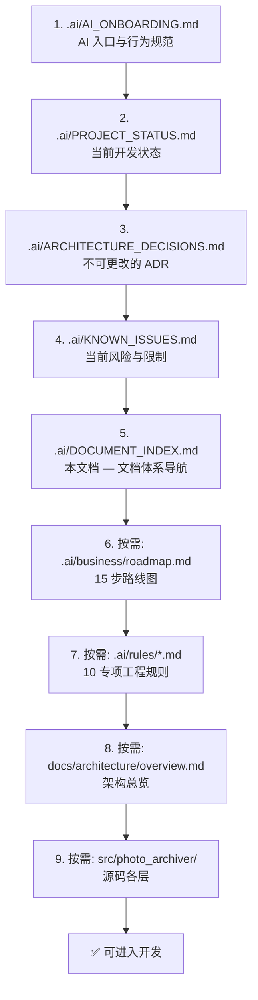

# DOCUMENT_INDEX.md — PhotoArchiver 文档体系导航

> **本文档是 PhotoArchiver 整个文档体系的唯一导航索引（Documentation System Index）。**
>
> 回答：**"项目里每份文档是什么职责、哪些权威、哪些废弃？"**
>
> 任何 AI 在 30 秒内读完本文即可理解整个文档体系结构。
>
> Version: 1.3.1 ｜ Status: Stable ｜ Last Updated: 2026-07-26

---

## 0. 文档治理四问（新增本文档的裁决记录）

1. **为什么不能写进已有文档？** 入口文档 `AI_ONBOARDING.md` 已 280 行，再塞导航会臖肿违反"最小上下文"；文档体系导航是独立职责，不属于入职/状态/ADR/Issues 任一。
2. **它是不是新的 SSOT？** **是**。它是"文档体系结构"的唯一 SSOT——其他文档涉及文档清单处应交叉引用本文。
3. **它未来由谁维护？** 文档体系结构变化时（新增/废弃/归档文档），由当前会话的 Tech Lead AI 维护，触发与 `AI_ONBOARDING.md` §10 一致。
4. **它什么时候可以删除？** 当文档体系简化到无需导航（项目归档或重写），或被未来更高级的文档治理体系明示裁决取代时。

---

## 1. AI 阅读顺序（Reading Order）

> 权威加载顺序见 `.ai/AI_ONBOARDING.md` §2。本节为体系全景图。



**最小恢复集**：第 1-5 步。任务范围明确后按需读第 6-9 步，**不要全树预读**以节约 Token。

---

## 2. 每份文档职责（Documentation Responsibilities）

### 2.1 AI Runtime Context（`.ai/` 根，新体系四文档 + 导航）

| 文档 | 职责 | 类型 |
|---|---|---|
| `.ai/AI_ONBOARDING.md` | AI 唯一入口、加载顺序、AI 行为规范 | SSOT — 入口 |
| `.ai/PROJECT_STATUS.md` | 当前 Phase/Step/HEAD/最近会话/下一步/阻塞 | SSOT — 实时状态 |
| `.ai/ARCHITECTURE_DECISIONS.md` | 已裁决 ADR Register（不可重新设计） | SSOT — 架构决策 |
| `.ai/KNOWN_ISSUES.md` | 当前未决 Bug/技术债/平台限制/workaround | SSOT — 问题清单 |
| `.ai/DOCUMENT_INDEX.md`（本文） | 文档体系导航索引 | SSOT — 文档结构 |
| `.ai/rules/CONTEXT_HANDOFF_RULES.md` | AI 接力交接元规则（New Conversation Prompt 规范） | SSOT — 交接元规则 |

### 2.2 工程规则（`.ai/rules/`，10 文件，权威）

| 文档 | 职责 | SSOT 主题 |
|---|---|---|
| `.ai/rules/README.md` | 规则元规则、优先级、生命周期 | 规则元规则 |
| `.ai/rules/ai-rules.md` | AI 行为总纲、业务工作流 | 业务工作流 |
| `.ai/rules/architecture-rules.md` | 分层架构、模块职责、依赖方向 | 分层架构图、模块职责 |
| `.ai/rules/dependency-rules.md` | 依赖矩阵、第三方库清单 | 技术栈清单 |
| `.ai/rules/coding-rules.md` | Python 编码标准 | 编码标准 |
| `.ai/rules/worker-rules.md` | 后台任务标准 | Worker 标准 |
| `.ai/rules/ui-rules.md` | PySide6 UI 标准 | UI 标准 |
| `.ai/rules/git-rules.md` | Git 工作流、提交规范 | Git 标准 |
| `.ai/rules/review-rules.md` | 审查清单、质量门 | Review Checklist 总表 |
| `.ai/rules/audit-methodology.md` | 文档一致性审计方法论（轻量复审节奏） | 审计方法论 |

### 2.3 业务与路线图

| 文档 | 职责 | 类型 |
|---|---|---|
| `.ai/business/roadmap.md` | 15 步开发路线图与每步交付清单 | SSOT — 路线图 |

### 2.4 人类开发者文档（`docs/` + 根）

| 文档 | 职责 | 类型 |
|---|---|---|
| `README.md` | 项目概览、快速开始、当前进度 | 人类入口 |
| `docs/architecture/overview.md` | 架构目标、分层、模块、开发路径 | 架构详解 |
| `docs/deployment/project-structure.md` | 顶层与源码目录结构说明 | 目录结构详解 |
| `docs/development/getting-started.md` | 环境准备、运行、测试、质量检查 | 开发入门 |
| `docs/development/configuration.md` | `.env` 配置项、默认值、约束 | 配置详解 |
| `docs/development/plugin-guide.md` | 插件开发指南（Step 15） | 开发者文档 |
| `docs/development/plugin-context-design.md` | B5 PluginContext 接口设计方案（B5-a 前置门产出 + v2 收敛版）——设计决策依据，非 SSOT（现状以代码与 `PROJECT_STATUS.md` 为准；B5-a 裁决在 `ARCHITECTURE_DECISIONS.md`） | 设计文档 |
| `docs/development/phase1-adr-draft.md` | 阶段 1 PluginContext 公共边界加固 ADR-026 定稿草案（前置门产出，含拍板记录 + Protocol-first 顺序 + 完成标准；ADR-026 Accepted 条目在 `ARCHITECTURE_DECISIONS.md`） | 设计文档 |
| `docs/development/phase2-adr-draft.md` | 阶段 2 Alembic migration 接管 Schema DDL ADR-027 定稿草案（前置门产出，含拍板记录 + 完成标准；ADR-027 Accepted 条目在 `ARCHITECTURE_DECISIONS.md`） | 设计文档 |
| `docs/development/phase3-adr-draft.md` | 阶段 3 插件写能力 import_people ADR-028 定稿草案（前置门产出，含拍板记录 + 完成标准；ADR-028 Accepted 条目在 `ARCHITECTURE_DECISIONS.md`） | 设计文档 |
| `docs/development/phase4-adr-draft.md` | 阶段 4 技术债轮前置门草案（兼容路径移除轮次 / search_photos N+1 批量查询方案与实测基线 / export 写能力与审批门裁决点；Proposed 待拍板） | 设计文档 |
| `LICENSE_PLACEHOLDER.md` | License 占位 | 待定 |

### 2.5 工程配置

| 文件 | 职责 |
|---|---|
| `pyproject.toml` | Python 工程配置（Black/Ruff/isort/pytest/MyPy） |
| `requirements/README.md` | 依赖清单说明 |
| `requirements/base.txt` | 运行依赖（含 AI 核心库） |
| `requirements/dev.txt` | 开发依赖（含 base） |
| `requirements/ai.txt` | AI 扩展依赖挂载点（当前空，AI 核心库已在 base） |

---

## 3. SSOT 文档清单（Single Source of Truth）

> 每种信息只在此处一份。其他文档应交叉引用，不复制。

| 信息主题 | 唯一权威文档 |
|---|---|
| AI 入口与加载顺序 | `.ai/AI_ONBOARDING.md` §2 |
| AI 行为规范 | `.ai/rules/ai-rules.md` |
| 当前开发状态 / 最近会话 / 下一步 | `.ai/PROJECT_STATUS.md` |
| 架构决策（ADR） | `.ai/ARCHITECTURE_DECISIONS.md` |
| 当前未决问题 / 技术债 | `.ai/KNOWN_ISSUES.md` |
| 文档体系结构 | `.ai/DOCUMENT_INDEX.md`（本文） |
| AI 接力交接元规则 | `.ai/rules/CONTEXT_HANDOFF_RULES.md` |
| 业务工作流 | `.ai/business/roadmap.md` §2 |
| 技术栈与第三方库清单 | `.ai/rules/dependency-rules.md` §13 |
| 分层依赖图+矩阵 | `.ai/rules/dependency-rules.md` §2/§4 |
| 模块职责 | `.ai/rules/architecture-rules.md` §4（ARC-001~009） |
| 编码标准 | `.ai/rules/coding-rules.md` |
| Worker / UI / Git / Review 标准 | `.ai/rules/{worker,ui,git,review}-rules.md` |
| Review Checklist 总表 | `.ai/rules/review-rules.md` §22 |
| 文档一致性审计方法论 | `.ai/rules/audit-methodology.md` |
| 15 步路线图 | `.ai/business/roadmap.md` |
| 配置项详解 | `docs/development/configuration.md` |
| 目录结构详解 | `docs/deployment/project-structure.md` |
| 架构详解 | `docs/architecture/overview.md` |
| 项目概览（人类入口） | `README.md` |

---

## 4. Deprecated 文档清单（废弃，已删除）

> 废弃日期：2026-07-18 ｜ 废弃裁决：AI Runtime Context 体系建立（`.ai/rules/CONTEXT_HANDOFF_RULES.md`）
>
> 2026-07-24 裁决2授权执行：以下 7 份废弃文档已物理删除（`git rm`）。独有信息已迁入新四文档体系（audit-methodology.md 等），其残留的 ARC-014 旧编号引用会持续污染 grep 检索结果故删除收口。各文档顶部 Deprecated banner 历史保留于 git。

| 文档 | 废弃原因 | 替代文档 |
|---|---|---|
| `AI_ONBOARDING.md`（根目录旧版） | 同名异位，已迁至 `.ai/` 下 | `.ai/AI_ONBOARDING.md` |
| `.ai/START_HERE.md` | 旧体系入口，与新四文档重叠 | `.ai/AI_ONBOARDING.md` |
| `.ai/PROJECT_CONTEXT.md` | 项目定位/技术栈/模块职责已迁入新四文档 | `.ai/AI_ONBOARDING.md` §1 + `.ai/ARCHITECTURE_DECISIONS.md` |
| `.ai/TASK_WORKFLOW.md` | 开发工作流已迁入入口文档 §6 | `.ai/AI_ONBOARDING.md` §6 + `.ai/rules/ai-rules.md` |
| `.ai/README.md` | 元规则已由 `.ai/rules/README.md` 承载 | `.ai/rules/README.md` + `.ai/DOCUMENT_INDEX.md` |
| `.ai/Session-Handoff-2026-07-17.md` | 会话交接已由 PROJECT_STATUS §5 实时承载；且违反交接元规则 P5（不应成永久文档） | `.ai/PROJECT_STATUS.md` §5 |
| `.ai/Consistency-Audit-2026-07-13.md` | 已裁决冲突迁入 ADR R 段，未决冲突迁入 KNOWN_ISSUES | `.ai/ARCHITECTURE_DECISIONS.md` R 段 + `.ai/KNOWN_ISSUES.md` |

---

## 5. Archive 文档清单（归档）

> 当前为空。归档操作发生在 Deprecated 文档需进一步移出主树时（如项目重整）。本节预留结构，遵守"Keep → Deprecate → Archive → Delete"原则。

---

## 6. Placeholder 文档清单（占位，已删除）

> 2026-07-24 裁决1授权执行：以下 11 份占位空文档已物理删除（`git rm`）。新四文档体系已接管职责，删除后不再保留占位段。空父目录（`.ai/architecture/`、`.ai/context/`、`.ai/prompts/`、`.ai/templates/`）及 3 个空占位目录（`.ai/{conventions,decisions,examples}/`）一并删除。

```
.ai/architecture/{architecture,lifecycle,modules}.md
.ai/business/{requirements,workflow}.md
.ai/context/project-status.md
.ai/prompts/{bugfix,codex,feature,review}.md
.ai/templates/module-template.md
```

### 6.1 空目录补录（2026-07-24 SSOT 收敛登记）

以下 3 个空占位目录随裁决1一并删除：

```
.ai/conventions/    # 约定占位目录，无文件，已删
.ai/decisions/      # 决策占位目录，无文件，已删
.ai/examples/       # 示例占位目录，无文件，已删
```

---

## 7. 维护规则

- 文档体系结构变化（新增/废弃/归档）时必须同步本文。
- 新增文档前必须回答"文档治理四问"（本文 §0），并经明确裁决。
- Deprecated 文档正文保留，仅顶部加 banner；进一步移至 Archive 需新一轮裁决。

---

> 📝 本文件由 AtomCode (GLM-5.2) 于 2026-07-18 基于真实文档体系生成。维护触发与 `.ai/AI_ONBOARDING.md` §10 一致。

End of DOCUMENT_INDEX.md
