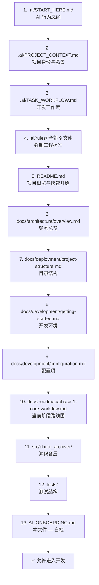
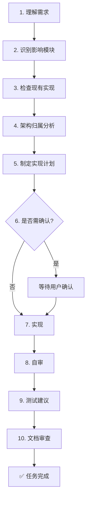
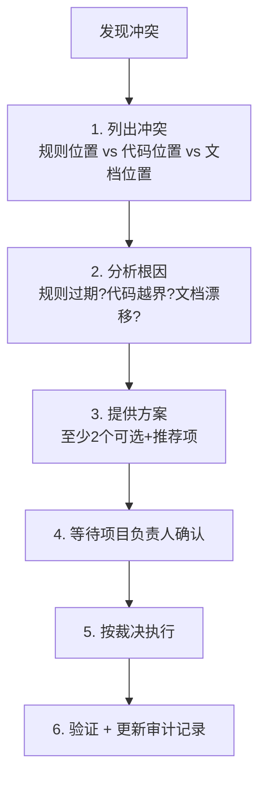

# AI_ONBOARDING.md — PhotoArchiver AI 入职指南

> ⚠️ **DEPRECATED — DO NOT READ**
>
> 本文档已废弃，仅保留作历史参考。**新 AI Session 请勿从本文开始入职。**
>
> **替代文档**：`.ai/AI_ONBOARDING.md`（新 AI Runtime Context 唯一入口，同名异位）
>
> 废弃日期：2026-07-18 ｜ 废弃裁决：AI Runtime Context 体系建立（`.ai/rules/CONTEXT_HANDOFF_RULES.md`），入职指南统一迁至 `.ai/` 下
>
> 历史正文保留于下方，仅供追溯。

---

> **本文档是任何 AI 编码助手接手 PhotoArchiver 项目时的唯一统一入口（Single Entry Point）。**
>
> Version: 1.0.0 ｜ Last Updated: 2026-07-13 ｜ Status: Stable
> Maintainer: PhotoArchiver Project Architect
> Scope: Codex / Claude Code / Gemini CLI / Cursor / Windsurf / Roo Code / AtomCode 及任何未来 AI 编码助手

---

> ⚠️ **Warning**
>
> 本文不是 README，不是项目介绍，不是开发文档。
>
> 本文是**指导 AI 如何理解项目、如何建立上下文、如何进入开发流程的操作手册**。
>
> 本文**引用** `.ai/`、`docs/`、源码中的权威内容，**不重复**其正文。
>
> 任何 AI 在开始开发前**必须**完整阅读本文并完成 §14 Onboarding Checklist 与 §15 Knowledge Verification。

---

## 目录（Table of Contents）

1. [Project Identity](#1-project-identity)
2. [Project Goals](#2-project-goals)
3. [Reading Order](#3-reading-order)
4. [Project Structure](#4-project-structure)
5. [Architecture Overview](#5-architecture-overview)
6. [Current Project Status](#6-current-project-status)
7. [Development Workflow](#7-development-workflow)
8. [AI Working Rules](#8-ai-working-rules)
9. [Conflict Resolution](#9-conflict-resolution)
10. [Development Constraints](#10-development-constraints)
11. [Required Output](#11-required-output)
12. [Forbidden Actions](#12-forbidden-actions)
13. [Completion Checklist](#13-completion-checklist)
14. [Onboarding Checklist](#14-onboarding-checklist)
15. [Knowledge Verification](#15-knowledge-verification)
16. [Known Conflicts](#16-known-conflicts)
17. [Pending Decisions](#17-pending-decisions)

---

## 1. Project Identity

| 项 | 值 |
|---|---|
| 项目名称 | PhotoArchiver |
| 一句话介绍 | 基于 DDD + Clean Architecture 的企业级桌面照片归档管理系统，面向学校/政府/企业/档案馆/摄影工作室等管理大量历史照片 |
| 当前开发阶段 | Phase 1 — 核心业务闭环建设（见 `docs/roadmap/phase-1-core-workflow.md`） |
| 当前完成度 | M1 基础就绪 + M2 数据入口基本完成；UI/Worker 接入/缩略图/AI 管线未启动 |
| 技术栈 | Python 3.11、PySide6、SQLite、OpenCV、InsightFace、ONNX Runtime、pandas、openpyxl、Pillow、SQLAlchemy、alembic、watchdog、pydantic、pydantic-settings、Loguru、pytest、pytest-qt、Ruff、MyPy（权威清单见 `.ai/rules/dependency-rules.md` §13） |
| 目标平台 | Windows、macOS |
| 仓库 | `github.com/Rookievegetable/PhotoArchiver` |
| 入口 | `main.py`（CLI 扫描模式 + PySide6 桌面模式） |

---

## 2. Project Goals

### 2.1 真正要解决的问题

机构持有数千至数万张照片，散落在无组织目录中：结构混乱、重复、缺元数据、难以检索、人工分类耗时。PhotoArchiver 自动化这些重复性归档任务。

### 2.2 长期目标（见 `.ai/PROJECT_CONTEXT.md` §Project Goals）

人员导入 → 目录扫描 → 元数据提取 → 缩略图 → 人脸检测 → 人脸识别 → 人员匹配 → 用户复核 → 归档组织 → 导出报告。每步独立可测。

### 2.3 当前阶段目标（Phase 1）

把项目从"基础架构可启动"推进到"核心业务闭环可运行"：人员 TXT/Excel 导入、照片目录扫描、元数据读取、SQLite 持久化、最小 UI 操作路径稳定。**本阶段不优先实现 AI 识别**。完整路线图见 `.ai/business/roadmap.md`（15 步）与 `docs/roadmap/phase-1-core-workflow.md`。

---

## 3. Reading Order

> ⚠️ **Warning**
>
> 阅读顺序**不得跳过**。每步都为下一步建立必要上下文。



| 步 | 文件 | 必须理解 |
|---|---|---|
| 1 | `.ai/START_HERE.md` | AI 角色、强制阅读顺序、开发原则 |
| 2 | `.ai/PROJECT_CONTEXT.md` | 项目身份、愿景、目标用户、业务工作流 |
| 3 | `.ai/TASK_WORKFLOW.md` | 10 阶段开发工作流、升级规则 |
| 4 | `.ai/rules/*.md`（9 文件） | ai / coding / architecture / dependency / ui / worker / git / review / README 元规则 |
| 5 | `README.md` | 项目概览、技术栈、快速开始、当前进度 |
| 6 | `docs/architecture/overview.md` | 架构目标、分层、模块职责、开发路径 |
| 7 | `docs/deployment/project-structure.md` | 顶层与源码目录说明 |
| 8 | `docs/development/getting-started.md` | 环境准备、运行、测试、质量检查 |
| 9 | `docs/development/configuration.md` | `.env` 配置项、默认值、约束 |
| 10 | `docs/roadmap/phase-1-core-workflow.md` | Phase 1 已完成/尚未完成、开发顺序 |
| 11 | `src/photo_archiver/` | 现有模块、接口、服务、仓储、Worker |
| 12 | `tests/` | 单元/集成测试分布 |
| 13 | `AI_ONBOARDING.md`（本文件） | §14 Onboarding Checklist + §15 Knowledge Verification |

> 📝 **Note**
>
> `.ai/architecture/`、`.ai/business/{workflow,requirements}.md`、`.ai/context/project-status.md`、`.ai/prompts/`、`.ai/templates/` 当前为 **Placeholder 占位空文档**——SSOT 缺口，随模块推进逐步填充（见 `.ai/Consistency-Audit-2026-07-13.md` E-5）。

---

## 4. Project Structure

仅列 AI 必须知道的目录。详细说明见 `docs/deployment/project-structure.md`。

| 目录 | 职责 | AI 须知 |
|---|---|---|
| `.ai/` | AI 开发知识库与强制规则 | **开发前必读全树**；规则改动需裁决 |
| `docs/` | 面向人类开发者的文档 | architecture / development / roadmap / deployment 已有内容；api / design / user-guide 为空 |
| `src/photo_archiver/` | 应用源码（唯一源码根） | `src/` 布局，`PYTHONPATH=src` 或 `pyproject.toml` 装包 |
| `tests/` | 单元 + 集成测试 | `tests/unit/` + `tests/integration/`；pytest 配置在 `pyproject.toml` |
| `requirements/` | Python 依赖清单 | `base.txt` 运行、`dev.txt` 开发、`ai.txt` AI |
| `config/` | 静态配置文件目录 | 非 Python 模块；运行时配置走 `infrastructure/config/` |
| `data/` | 运行数据 | SQLite 数据库、缓存、导入导出；不提交 |
| `resources/` | 程序运行资源 | fonts / icons / images / models / styles / ui |
| `examples/` | 示例数据 | 测试与开发用 |
| `scripts/` | 维护脚本 | `bootstrap.py` 项目脚手架 |
| `main.py` | 程序入口 | CLI 扫描 + GUI 桌面 |
| `pyproject.toml` | 工程配置 | Black/Ruff/isort/pytest/MyPy |
| `.env.example` | 环境变量模板 | 复制为 `.env` 后修改 |

源码分层骨架（`src/photo_archiver/`）：

```mermaid
flowchart TD
    APP[app/<br/>启动与依赖装配] --> PREZ
    PREZ[presentation/<br/>PySide6 UI] --> APP_LAYER
    APP_LAYER[application/<br/>用例编排] --> DOM
    DOM[domain/<br/>纯业务模型] -.protocol.-> INFRA
    INFRA[infrastructure/<br/>技术适配] --> DOM
    WRK[workers/<br/>后台任务] --> APP_LAYER
    AI[ai/<br/>AI 能力] --> INFRA
    PLG[plugins/<br/>扩展预留] --> APP_LAYER
    COM[common/<br/>通用工具] -.被所有层引用.-
```

---

## 5. Architecture Overview

> 架构权威：`.ai/rules/architecture-rules.md`（v1.1.0）+ `docs/architecture/overview.md`

### 5.1 采用范式

- **DDD**（Domain-Driven Design）—— Domain 为架构中心
- **Clean Architecture** —— 依赖向内
- **Layered Architecture** —— 严格分层
- **Dependency Inversion** —— Application 依赖 Domain Protocol；Infrastructure 实现 Protocol
- **Protocol First** —— Python `typing.Protocol` 定义所有仓储与端口接口

### 5.2 依赖方向（不可逆）

```text
Presentation  →  Application  →  Domain  ←  Infrastructure
Workers  →  Application        AI  →  Infrastructure, Domain
Plugins  →  Application        Common  →  Standard Library only
```

### 5.3 模块职责一句话

| 模块 | 职责 | 权威规则 |
|---|---|---|
| `app/` | QApplication 生命周期、bootstrap 装配、上下文容器 | ARC-002 |
| `presentation/` | PySide6 窗口/对话框/控件/控制器，无业务逻辑 | ARC-001、UI-001~002 |
| `application/` | Command/DTO/UseCase/Service 编排业务用例，无 GUI、无 SQL | ARC-002、DEP-010~013 |
| `domain/` | Entity/ValueObject/Repository Protocol/Exception，零框架依赖 | ARC-003、DEP-020~023 |
| `infrastructure/` | SQLite/Filesystem/Image/Config/Logging 适配器，实现 Protocol | ARC-004、DEP-030~033 |
| `workers/` | 后台任务执行，通过 Qt Signals 通信，不含业务规则 | ARC-005、WRK-001~028、DEP-040~042 |
| `ai/` | 人脸检测/识别/匹配能力，不做业务决策 | ARC-006、DEP-050~052 |
| `common/` | 仅标准库的通用工具 | ARC-008、DEP-070~071 |
| `plugins/` | 扩展预留，仅经 public API | ARC-007、DEP-060~062 |

---

## 6. Current Project Status

> 权威进度：`docs/roadmap/phase-1-core-workflow.md` + `README.md` §当前开发进度

### 6.1 已完成

| Step | 内容 |
|---|---|
| 1 | Loguru 统一日志（控制台 + 文件，轮转 10MB/保留 30 天） |
| 2 | `AppSettings`(pydantic-settings) 配置加载，`.env` + 环境变量，校验与默认值 |
| 3 | SQLite 连接 + Schema 初始化（`PRAGMA user_version = 1`；SQLAlchemy/Alembic **延后**） |
| 4 | Domain：3 实体（Person/Photo/Folder）+ 3 值对象 + 3 仓储 Protocol + 异常 |
| 5 | TXT + Excel 人员导入适配器（支持有/无表头、指定 sheet） |
| 6 | 目录扫描（递归/非递归）+ Pillow 元数据读取 + 扫描注册闭环服务 |
| — | Worker 事件模型、任务基类、Qt 执行器、人员导入/扫描注册任务包装器 |
| — | CLI 入口 `python main.py scan <folder>` |
| — | 测试：domain/application/infrastructure/bootstrap/CLI/reader 单元 + 扫描注册集成 |

### 6.2 尚未完成

- Step 7 缩略图生成与缓存
- Step 8-10 AI 人脸检测/识别/匹配 + 用户审核状态
- Step 11 归档整理
- Step 12 完整 PySide6 工作台 UI（`QtWorkerExecutor` 已就绪但未被任何 UI 调用）
- Step 13 设置、Step 14 导出、Step 15 插件
- SQLAlchemy/Alembic 迁移体系
- Pillow 相关集成测试当前 FAILED（venv 未装 Pillow，且测试缺 `pytest.importorskip`）—— 既有环境问题，非代码缺陷

### 6.3 下一阶段目标

按 `docs/roadmap/phase-1-core-workflow.md` 开发顺序：文档校准 → Qt Worker 执行器接入 UI → 最小可操作 PySide6 工作台 → 缩略图缓存 → AI 识别预备。

---

## 7. Development Workflow

> 权威：`.ai/TASK_WORKFLOW.md`（10 阶段）+ `.ai/START_HERE.md` §When You Receive a Task

**任何开发任务必须按以下顺序执行，不得直接编码：**



**需用户确认的情形**（`.ai/TASK_WORKFLOW.md` Phase 6）：

- 新增依赖
- 改变项目结构
- 修改公开 API
- 改变数据库 Schema
- 改变配置格式
- 引入破坏性变更

> ⚠️ **Warning**
>
> 跳过任何步骤都会增加缺陷与架构不一致风险。**不确定时：读文档，不编码。**

---

## 8. AI Working Rules

> 权威：`.ai/rules/ai-rules.md`（v1.1.0）+ `.ai/rules/architecture-rules.md` + `.ai/rules/dependency-rules.md`
>
> 本节仅列**最高优先级**规则。完整规则见上述权威文件。

| # | 规则 | Source |
|---|---|---|
| 1 | **禁止跨层依赖**：Presentation 不导入 Infrastructure/SQLite/OpenCV/InsightFace；Domain 不导入任何框架 | DEP-002/021、ARC-003 |
| 2 | **禁止修改公开 API** 未经验证 | AI-006、GIT-017 |
| 3 | **禁止新增依赖**未经项目批准 | AI-003、DEP-013 |
| 4 | **禁止修改数据库 Schema** 未确认 | TASK_WORKFLOW Phase 6 |
| 5 | **禁止绕过 Domain 层**做业务决策 | ARC-003、DEP-013 |
| 6 | **禁止违反 Rules**——规则优先于个人判断 | `.ai/rules/README.md` §3 |
| 7 | **禁止 `print()`**，用 Loguru | COD-051 |
| 8 | **禁止 TODO/FIXME/pass 占位**进生产代码 | AI-008 |
| 9 | **禁止 bare `except`** 与静默吞异常 | COD-060、AI-010 |
| 10 | **长耗时任务必须走 Worker**，UI 通过 Signal 通信 | WRK-001/003、UI-011 |

---

## 9. Conflict Resolution

> ⚠️ **Warning**
>
> 规则、代码、文档三者冲突时，**AI 不得自行决定**。

### 9.1 冲突处理流程



### 9.2 规则优先级（`.ai/rules/README.md` §3）

1. 当前用户指令
2. `.ai/rules/`
3. `.ai/architecture/`
4. `.ai/business/`
5. `.ai/prompts/`
6. `.ai/templates/`

同级冲突取**更严格**的规则；仍模糊则**请求澄清**。

### 9.3 已知冲突与已裁决记录

见本文 §16 Known Conflicts 与 `.ai/Consistency-Audit-2026-07-13.md`（完整审计报告）。

---

## 10. Development Constraints

> 权威：`.ai/rules/coding-rules.md`（v1.1.0）+ `pyproject.toml`

| 约束 | 要求 | Source |
|---|---|---|
| Python 版本 | 3.11+，不写兼容代码 | COD-001 |
| 类型提示 | 公共函数必须 | COD-030 |
| Docstring | 公共类/函数必须，Google Style | COD-040/041/042 |
| 行宽 | **100 字符**（Ruff/Black/isort 统一） | COD-005、`pyproject.toml` |
| 格式化 | Ruff + Black + isort(black profile) | `pyproject.toml` |
| 类型检查 | MyPy 通过 | `pyproject.toml` |
| 测试 | pytest，`tests/` 目录 | `pyproject.toml` |
| 路径 | `pathlib.Path`，禁 `os.path`/字符串拼接 | COD-070/071 |
| 日志 | Loguru，禁 `print()` | COD-050/051 |
| 异常 | 禁 bare `except`，预期异常显式处理，意外异常记录 | COD-060/061/062 |
| 命名 | PascalCase 类、snake_case 函数/变量、UPPER_CASE 常量、`_` 前缀私有 | COD-020~024 |
| Magic Number | 禁止，用命名常量 | COD-080 |
| 导入顺序 | 标准库 → 第三方 → 项目模块；禁 wildcard；禁未用；禁循环 | COD-010~013 |
| Commit | Conventional Commits（`feat:`/`fix:`/`docs:` 等） | GIT-006 |
| 资源 | 文件用 context manager；DB 连接正确关闭 | COD-110/111 |

---

## 11. Required Output

> 每次开发结束**必须**输出以下结构，不得仅输出"已完成"：

```markdown
## 实现总结
- 目标：
- 改动概述：

## 修改文件
| 文件 | 改动 |
|---|---|

## 影响模块
- ...

## 影响范围
- ...

## 测试结果
- 命令：
- 结果：

## 风险
- ...

## 下一步建议
- ...
```

> 📝 **Note**
>
> 大型内容生成任务（如本文件）需**增量写入**避免单次截断；编码任务需 **fast check 验证**（`compileall`/`pytest`/`ruff`）。

---

## 12. Forbidden Actions

> 除非得到项目负责人**明确确认**，禁止以下操作：

| # | 禁止动作 | Source |
|---|---|---|
| 1 | 修改 `.ai/rules/` 任何规则条文 | `.ai/rules/README.md` §8 |
| 2 | 修改 `LICENSE` / `LICENSE_PLACEHOLDER.md` | GIT-016 |
| 3 | 修改 `.github/workflows/` CI 配置 | TASK_WORKFLOW Phase 6 |
| 4 | 修改 `pyproject.toml` 工程配置 | TASK_WORKFLOW Phase 6 |
| 5 | 修改 `.env.example` / `config/` 配置格式 | TASK_WORKFLOW Phase 6 |
| 6 | 删除测试 | AI-006 |
| 7 | 删除文档 | AI-006 |
| 8 | 删除注释（含中文注释） | AI-006、CHINESE CODE SUPPORT |
| 9 | 新增依赖 | AI-003、DEP-013 |
| 10 | 修改数据库 Schema / 迁移 | TASK_WORKFLOW Phase 6 |
| 11 | 重命名/移动公开模块 | GIT-017 |
| 12 | 改变架构边界 / 新增顶层包 | ARC-003、AI-007 |
| 13 | 绕过 `application/` 直接 Presentation→Infrastructure | DEP-003/004 |
| 14 | 在 Widget 中写业务逻辑 | UI-002、COD-122 |
| 15 | 在 Worker 中操作 Widget | WRK-003、DEP-041 |

---

## 13. Completion Checklist

> 每次开发结束**必须**逐项勾选（`.ai/rules/review-rules.md` §22 为总权威）：

- [ ] Rules 已遵守（ai/coding/architecture/dependency/ui/worker/git/review）
- [ ] Architecture 分层正确
- [ ] Dependency 方向无误，无 forbidden import
- [ ] Ruff 通过
- [ ] MyPy 通过
- [ ] pytest 通过
- [ ] 无 TODO/FIXME/XXX 占位
- [ ] 无 `print()`
- [ ] 无 Magic Number
- [ ] 类型提示完整
- [ ] Docstring 完整（公共 API）
- [ ] 异常处理合规
- [ ] 文档同步（README/docs/.ai 按需）
- [ ] Commit Message 符合 Conventional Commits
- [ ] 改动范围最小，无无关重构

---

## 14. Onboarding Checklist

> ⚠️ **Warning**
>
> AI **第一次进入项目**必须确认以下全部条目，**否则不得开始开发**：

- [ ] 我已阅读 `.ai/START_HERE.md`
- [ ] 我已阅读 `.ai/PROJECT_CONTEXT.md`
- [ ] 我已阅读 `.ai/TASK_WORKFLOW.md`
- [ ] 我已阅读 `.ai/rules/` 全部 9 文件
- [ ] 我已阅读 `README.md`
- [ ] 我已阅读 `docs/architecture/overview.md`
- [ ] 我已阅读 `docs/development/getting-started.md`
- [ ] 我已阅读 `docs/development/configuration.md`
- [ ] 我已阅读 `docs/roadmap/phase-1-core-workflow.md`
- [ ] 我已浏览 `src/photo_archiver/` 各层现有模块
- [ ] 我已浏览 `tests/` 结构
- [ ] 我理解项目目标（§2）
- [ ] 我理解目录结构（§4）
- [ ] 我理解当前开发阶段（§6）
- [ ] 我理解依赖方向（§5）
- [ ] 我知道禁止事项（§12）
- [ ] 我知道冲突处理流程（§9）
- [ ] 我已阅读 `.ai/Consistency-Audit-2026-07-13.md`（已知冲突与已裁决记录）

---

## 15. Knowledge Verification

> Onboarding 完成后，AI **必须**回答以下问题。**答错则继续阅读，不要开发。**

### Q1. 项目目标是什么？

<details>
<summary>参考答案</summary>

基于 DDD + Clean Architecture 的企业级桌面照片归档系统，自动化机构大量历史照片的导入/扫描/识别/匹配/归档/导出流程。当前阶段聚焦核心业务闭环（人员导入 + 扫描 + 持久化 + 最小 UI），不优先 AI 识别。
</details>

### Q2. 目前完成到哪里？

<details>
<summary>参考答案</summary>

Phase 1 的 Step 1-6 已完成（日志/配置/SQLite/Domain/人员导入/扫描注册），Worker 事件模型与 Qt 执行器就绪。未完成：缩略图、AI 管线、完整 UI、归档、导出、SQLAlchemy/Alembic 迁移。
</details>

### Q3. 下一阶段是什么？

<details>
<summary>参考答案</summary>

文档校准 → Qt Worker 执行器接入 UI → 最小可操作 PySide6 工作台（人员导入入口 + 目录扫描 + 进度展示 + 基础照片列表）→ 缩略图缓存 → AI 识别预备。
</details>

### Q4. 当前最大风险是什么？

<details>
<summary>参考答案</summary>

1. **Git 工作区有大量未提交修改**（整个 `.ai/`、`docs/`、`src/photo_archiver/` 新结构均未入版本控制，HEAD `d43ae1a` 只反映初始化状态）——违反 GIT-001 "main MUST always remain buildable" 精神。
2. **11 个 `.ai/` 文档为 Placeholder 占位**——SSOT 不完整，AI 协作时这些文档无法提供实质指引。
3. **Pillow 集成测试 FAILED**（venv 未装 Pillow + 测试缺 `pytest.importorskip`）——既有环境问题，非代码缺陷。
</details>

### Q5. 有哪些架构约束？

<details>
<summary>参考答案</summary>

- 分层：Presentation → Application → Domain ← Infrastructure；Workers → Application；AI → Infrastructure+Domain；Common 仅标准库
- Domain 零框架依赖（禁 PySide6/OpenCV/InsightFace/SQLite/pandas/openpyxl/SQLAlchemy）
- Presentation 禁导入 Infrastructure/SQLite/OpenCV/InsightFace
- Application 禁导入 PySide6、禁执行 SQL、必须用 Repository Protocol
- Workers 仅可导入 `PySide6.QtCore`（线程原语），禁导入 QtWidgets/QtGui
- SQLite 仅在 `infrastructure/database/`（ARC-014）
- 所有业务经由 Application 编排
</details>

### Q6. 哪些修改必须确认？

<details>
<summary>参考答案</summary>

新增依赖、改项目结构、改公开 API、改数据库 Schema、改配置格式、引入破坏性变更、修改规则条文、修改 License/CI/pyproject/配置格式、重命名公开模块、改变架构边界。详见本文 §9 与 §12。
</details>

---

## 16. Known Conflicts

> 权威审计：`.ai/Consistency-Audit-2026-07-13.md`（2026-07-13 完整审计）
>
> 本节记录**已识别且已裁决或待裁决**的规则/代码/文档冲突。AI 开发时遇冲突应先查本节。

### 16.1 已裁决并修正

| ID | 冲突 | 裁决 | 状态 |
|---|---|---|---|
| R-1 | Workers 层导入 `PySide6.QtCore` vs DEP-040 依赖矩阵未授权 | 更新 DEP-040 + WRK-002，允许 `PySide6.QtCore`（线程原语 only） | ✅ 已执行 |
| R-2 | SQLite 代码在 `infrastructure/repositories/` vs ARC-014 要求 `infrastructure/database/` | 迁移至 `infrastructure/database/` | ✅ 已执行 |
| R-3 | COD-005 行宽 88 vs `pyproject.toml` 行宽 100 | 统一为 100 | ✅ 已执行 |
| R-4 (C-1) | ARC-008 §8 "仓储实现 infrastructure/repositories/" vs §14 "SQLite 在 infrastructure/database/" | §8 加 SQLite 例外条款 | ✅ 已执行 |
| R-5 (C-2) | `pydantic` 标 "if introduced" 但已投入使用 | 升为正式批准，补入 ai-rules §3 | ✅ 已执行 |
| R-6 (C-4) | 6 项库（Pillow/SQLAlchemy/alembic/watchdog/pytest-qt/ONNX）未进 §13/§3 | 补入并标注层归属 | ✅ 已执行 |
| R-7 (C-5) | ARC-018 §18 允诺 `common/logging/` vs DEP-071 禁 common 导第三方 | 删除 `common/logging/` 选项 | ✅ 已执行 |

### 16.2 待裁决（P1~P3，推迟到 Phase 1 收尾或按模块推进）

| ID | 冲突 | 建议处置 | 优先级 |
|---|---|---|---|
| C-3 | `config/` 顶层目录在 ARC-017 允诺但依赖矩阵未授权 | 补注释或删 §17 选项 | P1 |
| C-6/E-1 | `docs/architecture/overview.md` §6 "尚未实现" 列表均已实现 | Phase 1 收尾统一更新 | P1 |
| E-2 | `README.md` 待实现列表未列已完成项 | Phase 1 收尾统一更新 | P1 |
| C-7 | `roadmap.md` Step 3 要求 SQLAlchemy/Alembic，实际用 sqlite3 + PRAGMA | 加注"延后" | P1 |
| D-1~D-5 | 5 处规则重复承载（业务工作流/技术栈/分层图/模块职责/Review Checklist） | SSOT 收敛，每条规则只在一处落正文 | P2 |
| E-5 | 11 个 `.ai/` 文档为 Placeholder 占位 | 随模块推进逐步填充 | P3 |

---

## 17. Pending Decisions

> 以下事项**需项目负责人裁决**。AI 不得自行决定。

| # | 事项 | 背景 | 建议方案 |
|---|---|---|---|
| 1 | Git 工作区大量未提交修改 | HEAD `d43ae1a` 只反映初始化，整个 `.ai/`、`docs/`、`src/photo_archiver/` 新结构未入版本控制 | 整理为一系列 Conventional Commits 提交（裁决 #4 已指示"暂不提交"） |
| 2 | C-3 `config/` 顶层目录地位 | ARC-017 允诺但依赖矩阵未列 | 补注释说明"仅静态配置文件目录，非 Python 模块" |
| 3 | C-6/E-1/E-2 文档校准时机 | 与裁决 #5 "Phase 1 收尾" 张力 | 确认是否提前至本轮或维持推迟 |
| 4 | C-7 roadmap Step 3 标注 | SQLAlchemy/Alembic 延后未标注 | 加注"当前 sqlite3 + PRAGMA 临时实现" |
| 5 | D-1~D-5 SSOT 收敛 | 5 处规则重复承载 | 本轮启动还是推迟？ |
| 6 | E-5 Placeholder 填充 | 11 个空文档 | 本轮填充还是按模块推进？ |
| 7 | Pillow 测试 skip | `tests/unit/infrastructure/test_photo_metadata_readers.py` 缺 `pytest.importorskip("PIL")` | 补 skip 跳码还是装齐 `requirements/base.txt`？ |

---

> 📝 **Note**
>
> 本文件由 AtomCode (GLM-5.2) 于 2026-07-13 基于真实项目分析生成。
>
> 所有信息来自 `.ai/`、`docs/`、源码、工程文件的真实内容——不凭空生成。
>
> 本文件应与 `.ai/Consistency-Audit-2026-07-13.md` 配套使用；冲突处置后需同步更新本文件 §16。
>
> 维护规则：架构演进、规则版本 bump、模块新增/迁移时需同步本文件。

---

End of AI_ONBOARDING.md
